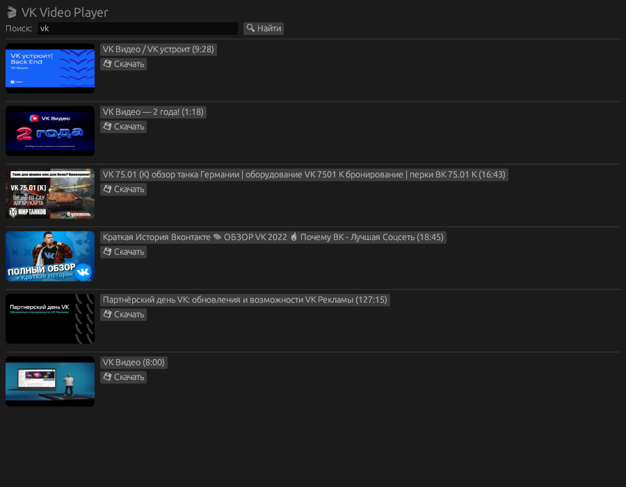

<div align="center">

# vk-video-native

Нативный десктопный клиент VK Video.

**Rust · egui · mpv · yt-dlp** — без WebView, Electron и браузера.

[](https://www.rust-lang.org)
[](https://github.com/emilk/egui)
[](https://mpv.io)
[]()
[](LICENSE)



</div>

---

## Возможности

- Поиск видео через VK API (`video.search`, v5.199)
- Воспроизведение в **mpv** — извлечение стримов через встроенный в mpv yt-dlp
- Скачивание видео в системную папку «Загрузки» (склейка video+audio в mp4)
- Асинхронные превью: загрузка и JPEG-декодирование в фоновых потоках, skeleton-плейсхолдеры в UI
- UI-поток не блокируется сетью и декодированием — все данные приходят через `mpsc`-каналы
- GPU-рендеринг интерфейса, минимальное потребление ОЗУ

## Требования

| Компонент | Назначение | Установка (Linux) |
|---|---|---|
| `mpv` | воспроизведение | `sudo apt install mpv` |
| `yt-dlp` | извлечение стримов | `sudo apt install yt-dlp` |
| `ffmpeg` | склейка дорожек при скачивании | `sudo apt install ffmpeg` |
| Rust toolchain | сборка | `rustup` |

## Сборка и запуск

```bash
# Linux
sudo apt install mpv yt-dlp ffmpeg libssl-dev pkg-config
cargo build --release
./target/release/vk-video-native
```

```bash
# macOS
brew install mpv yt-dlp ffmpeg
cargo build --release
```

```powershell
# Windows: mpv, yt-dlp и ffmpeg должны быть в PATH
cargo build --release
```

## Авторизация

Приложение работает с пользовательским токеном с правами `video`.
Токен хранится в файле `.vk_token` в рабочей директории и передаётся только в `api.vk.com`.

```bash
echo "<ВАШ_ТОКЕН>" > .vk_token
chmod 600 .vk_token
```

Получение токена: [vkhost.github.io](https://vkhost.github.io) — выберите приложение,
отметьте `video` + `offline`, скопируйте `access_token` из redirect-URL.

> Сервисный ключ приложения не подходит: `video.search` недоступен с ним (ошибка API 28).

## Использование

| Действие | Результат |
|---|---|
| `Enter` / кнопка «Найти» | поиск видео |
| клик по названию | воспроизведение в mpv |
| «Скачать» | загрузка mp4 в `~/Downloads` |
| закрытие окна mpv | автоматический возврат к списку |

## Архитектура

```
              ┌───────────────────────────────────────────┐
              │            egui (UI-поток)                │
              │   список, скелетоны, TextureHandle        │
              └────────────▲───────────────▲──────────────┘
                     mpsc  │         mpsc  │
              ┌────────────┴────┐   ┌──────┴───────────────┐
              │ поток поиска    │   │ потоки превью         │
              │ reqwest + tokio │   │ reqwest::blocking +   │
              │ VK API          │   │ image (JPEG decode)   │
              └─────────────────┘   └───────────────────────┘
              ┌─────────────────┐   ┌───────────────────────┐
              │ mpv (subprocess)│   │ yt-dlp (subprocess)   │
              │ воспроизведение │   │ скачивание + merge    │
              └─────────────────┘   └───────────────────────┘
```

| Подсистема | Реализация |
|---|---|
| GUI | `egui` / `eframe`, immediate mode, GPU |
| VK API | `reqwest` (async), фоновый поток |
| Превью | `reqwest::blocking` + `image`, фоновые потоки, кэш в `HashMap` |
| Воспроизведение | subprocess `mpv` со встроенным yt-dlp |
| Скачивание | subprocess `yt-dlp`, `bestvideo+bestaudio → mp4` |

## Roadmap

- [ ] кэш превью на диске
- [ ] история «продолжить просмотр»
- [ ] категории и рекомендации (как на vkvideo.ru)
- [ ] встроенный плеер (рендер кадров mpv в текстуру egui)
- [ ] CI-релизы для Linux / Windows / macOS

## Дисклеймер

Не является официальным продуктом VK. Использует публичное VK API от имени
пользователя. Уважайте [условия использования VK API](https://dev.vk.com/ru/rules)
и права правообладателей контента.

## Лицензия

[MIT](LICENSE)
